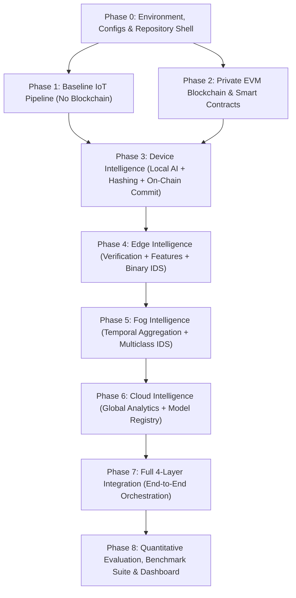

Viewed BlockIoTIntelligence_ADR_Implementation.md:1-800
Viewed IEEE_DataPort_Edge_IIoTset_Dataset_Preparation_Plan.md:1-128
Ran command: `python3 -c "
import pypdf
reader = pypdf.PdfReader('/home/anurag/IIITH/sem3/RIS/blockchain_proj_ref.pdf')
print('Num pages:', len(reader.pages))
text = ''
for i in range(min(5, len(reader.pages))):
    text += f'--- Page {i+1} ---\n' + reader.pages[i].extract_text()[:500] + '\n'
print(text[:2000])
" 2>&1 || pdftotext /home/anurag/IIITH/sem3/RIS/blockchain_proj_ref.pdf - | head -n 50`
Ran command: `grep -n "^#" /home/anurag/IIITH/sem3/RIS/BlockIoTIntelligence_ADR_Implementation.md`
Listed directory RIS
Listed directory NOTES
Ran command: `pdftotext /home/anurag/IIITH/sem3/RIS/Project_list.pdf - | grep -A 10 -B 2 "Project 15" || pdftotext /home/anurag/IIITH/sem3/RIS/Project_list.pdf - | grep -A 10 -B 2 "15"`
Ran command: `python3 -c "
import subprocess
out = subprocess.check_output(['pdftotext', '/home/anurag/IIITH/sem3/RIS/blockchain_proj_ref.pdf', '-']).decode('utf-8', errors='ignore')
print('Total characters:', len(out))
# Let's search for section headings
import re
headings = re.findall(r'\n([0-9]+\.?\s+[A-Z][^\n]+)', out)
for h in headings[:40]:
    print(h)
"`
Ran command: `python3 -c "
import subprocess, re
out = subprocess.check_output(['pdftotext', '/home/anurag/IIITH/sem3/RIS/blockchain_proj_ref.pdf', '-']).decode('utf-8', errors='ignore')

# find subsections of 3 and 4
subsections = re.findall(r'\n([3-5]\.[0-9]+(?:\.[0-9]+)?\s+[^\n]+)', out)
for s in subsections:
    print(s)

# also let's look at table and figure captions
figures = re.findall(r'\n(Fig\.\s+[0-9]+\.\s+[^\n]+)', out)
for f in figures:
    print(f)

tables = re.findall(r'\n(Table\s+[0-9]+\s*\n[^\n]+)', out)
for t in tables:
    print('---')
    print(t)
"`
Ran command: `python3 -c "
import subprocess, re
out = subprocess.check_output(['pdftotext', '/home/anurag/IIITH/sem3/RIS/blockchain_proj_ref.pdf', '-']).decode('utf-8', errors='ignore')

# Print matches around section 3
idx3 = out.find('3. Proposed BlockIoTIntelligence architecture')
idx4 = out.find('4. Evaluation of the proposed BlockIoTIntelligence architecture')
idx5 = out.find('5. Research challenges and possible solutions')
print('Section 3 length:', idx4 - idx3)
print(out[idx3:idx3+2500])
print('='*50)
print(out[idx3+2500:idx3+5000])
"`
Ran command: `python3 -c "
import subprocess
out = subprocess.check_output(['pdftotext', '/home/anurag/IIITH/sem3/RIS/blockchain_proj_ref.pdf', '-']).decode('utf-8', errors='ignore')
idx3 = out.find('3. Proposed BlockIoTIntelligence architecture')
idx4 = out.find('4. Evaluation of the proposed BlockIoTIntelligence architecture')
print(out[idx3+5000:idx3+10000])
"`
Ran command: `python3 -c "
import subprocess
out = subprocess.check_output(['pdftotext', '/home/anurag/IIITH/sem3/RIS/blockchain_proj_ref.pdf', '-']).decode('utf-8', errors='ignore')
idx3 = out.find('3. Proposed BlockIoTIntelligence architecture')
idx4 = out.find('4. Evaluation of the proposed BlockIoTIntelligence architecture')
print(out[idx3+10000:idx4])
"`
Ran command: `python3 -c "
import subprocess
out = subprocess.check_output(['pdftotext', '/home/anurag/IIITH/sem3/RIS/blockchain_proj_ref.pdf', '-']).decode('utf-8', errors='ignore')
idx4 = out.find('4. Evaluation of the proposed BlockIoTIntelligence architecture')
idx5 = out.find('5. Research challenges and possible solutions')
print(out[idx4:idx4+4000])
"`
Ran command: `python3 -c "
import subprocess
out = subprocess.check_output(['pdftotext', '/home/anurag/IIITH/sem3/RIS/blockchain_proj_ref.pdf', '-']).decode('utf-8', errors='ignore')
idx42 = out.find('4.2. Quantitative analysis')
idx43 = out.find('4.3. Architectural analysis')
if idx43 == -1:
    idx43 = out.find('5. Research challenges')
print(out[idx42:idx42+4000])
"`
Ran command: `python3 -c "
import subprocess, re
out = subprocess.check_output(['pdftotext', '/home/anurag/IIITH/sem3/RIS/blockchain_proj_ref.pdf', '-']).decode('utf-8', errors='ignore')
matches = [m.start() for m in re.finditer(r'Quantitative\s+analysis', out, re.IGNORECASE)]
for m in matches:
    print('Match at:', m)
    print(out[m-100:m+500])
    print('='*50)
"`
Ran command: `python3 -c "
import subprocess
out = subprocess.check_output(['pdftotext', '/home/anurag/IIITH/sem3/RIS/blockchain_proj_ref.pdf', '-']).decode('utf-8', errors='ignore')
idx = out.find('4.2. Quantitative Analysis')
print(out[idx:idx+15000])
"`
Ran command: `python3 -c "
with open('/home/anurag/IIITH/sem3/RIS/BlockIoTIntelligence_ADR_Implementation.md') as f:
    text = f.read()

import re
# Let's inspect Section 7 (AI/ML Design)
idx7 = text.find('# 7. AI/ML Design')
idx8 = text.find('# 8. Communication and Service Interfaces')
print('=== SECTION 7 ===')
print(text[idx7:idx8][:2000])

idx10 = text.find('# 10. Phased Implementation Plan')
idx11 = text.find('# 11. Experimental Design')
print('=== SECTION 10 summary ===')
print(text[idx10:idx10+1500])
"`
Ran command: `python3 -c "
with open('/home/anurag/IIITH/sem3/RIS/BlockIoTIntelligence_ADR_Implementation.md') as f:
    text = f.read()

import re
matches = re.findall(r'(## Phase [0-9]+[^\n]+)', text)
for m in matches:
    print(m)
"`
Ran command: `python3 -c "
with open('/home/anurag/IIITH/sem3/RIS/BlockIoTIntelligence_ADR_Implementation.md') as f:
    text = f.read()

phases = [
    '## Phase 0', '## Phase 1', '## Phase 2', '## Phase 3',
    '## Phase 4', '## Phase 5', '## Phase 6', '## Phase 7', '## Phase 8'
]

for i in range(len(phases)):
    start_str = phases[i]
    end_str = phases[i+1] if i+1 < len(phases) else '# 11. Experimental Design'
    p_start = text.find(start_str)
    p_end = text.find(end_str)
    print(f'=== {start_str} ===')
    sub = text[p_start:p_end]
    lines = sub.split('\n')
    for line in lines[:25]:
        print(line)
    print('...\n')
"`
Ran command: `python3 -c "
with open('/home/anurag/IIITH/sem3/RIS/BlockIoTIntelligence_ADR_Implementation.md') as f:
    text = f.read()

import re
sec11 = text[text.find('# 11. Experimental Design'):text.find('# 12. Paper-aligned')]
print('=== SECTION 11 ===')
print(sec11[:1500])

sec13 = text[text.find('# 13. AI-driven Blockchain'):text.find('# 14. Security Architecture')]
print('=== SECTION 13 ===')
print(sec13[:1200])

sec2a = text[text.find('# 2A. IEEE DataPort Dataset Strategy'):text.find('## Recommended project data strategy — final')]
print('=== SECTION 2A ===')
print(sec2a[:1500])
"`
Ran command: `python3 -c "
with open('/home/anurag/IIITH/sem3/RIS/BlockIoTIntelligence_ADR_Implementation.md') as f:
    text = f.read()

idx32 = text.find('# 32. Immediate Next Implementation Step')
print(text[idx32:])
"`

# Understanding & Implementation Blueprint: BlockIoTIntelligence

Based on a comprehensive review of the reference paper [blockchain_proj_ref.pdf](file:///home/anurag/IIITH/sem3/RIS/blockchain_proj_ref.pdf), the Architecture Decision Record [BlockIoTIntelligence_ADR_Implementation.md](file:///home/anurag/IIITH/sem3/RIS/BlockIoTIntelligence_ADR_Implementation.md), and the dataset preparation plan [IEEE_DataPort_Edge_IIoTset_Dataset_Preparation_Plan.md](file:///home/anurag/IIITH/sem3/RIS/IEEE_DataPort_Edge_IIoTset_Dataset_Preparation_Plan.md), here is the complete synthesis of the system, architecture, and exact components we need to implement.

---

## 1. Executive Summary & Core Objective

* **Project:** Research in Information Security (RIS) — **Project 15: Design of AI/ML-enabled Big Data Analytics for IoT Environment**.
* **Reference Paper:** S. K. Singh, S. Rathore, J. H. Park, *BlockIoTIntelligence: A Blockchain-enabled Intelligent IoT Architecture with Artificial Intelligence*, Future Generation Computer Systems 110 (2020), 721–743.
* **Primary Objective:** Build an executable, reproducible, research-grade implementation of the **BlockIoTIntelligence** architecture. The paper itself is an architectural and comparative synthesis paper (comparing existing literature across device, edge, fog, and cloud layers). Our implementation turns these concepts into a **concrete distributed system** featuring:
  1. Multi-tier intelligence (Device $\rightarrow$ Edge $\rightarrow$ Fog $\rightarrow$ Cloud).
  2. Integrated private blockchain for decentralized identity, data integrity, model provenance, and auditability.
  3. Real IoT/IIoT workload driven by the **IEEE DataPort Edge-IIoTset** dataset.
  4. Rigorous empirical evaluation comparing **Baseline (No Blockchain)** vs. **Proposed (Blockchain-enabled)** across accuracy, latency, resource usage, security, and scalability.

---

## 2. Core Concepts from the Reference Paper

The reference paper establishes four key dimensions that our system must faithfully embody:

```
┌────────────────────────────────────────────────────────────────────────┐
│                          CLOUD INTELLIGENCE                            │
│  Application Layer • Big Data Analytics • Model Training & Comparison  │
│          Decentralized Model Registry • DVFS / Resource Mgmt           │
└───────────────────────────────────┬────────────────────────────────────┘
                                    │ Intermediate aggregates & models
┌───────────────────────────────────┴────────────────────────────────────┐
│                           FOG INTELLIGENCE                             │
│  Service & Mgmt Layers • Multi-Edge Aggregation • Temporal Flow Analysis│
│      Rapid Attack Detection (Multiclass) • Blockchain Audit Log        │
└───────────────────────────────────┬────────────────────────────────────┘
                                    │ Processed features & alerts
┌───────────────────────────────────┴────────────────────────────────────┐
│                           EDGE INTELLIGENCE                            │
│  Communication & Link Control • Ingestion • Preprocessing & Scaling    │
│      Feature Extraction • Lightweight IDS • Hash Verification          │
└───────────────────────────────────┬────────────────────────────────────┘
                                    │ Raw telemetry & commitments
┌───────────────────────────────────┴────────────────────────────────────┐
│                          DEVICE INTELLIGENCE                           │
│  Physical Perception Layer • Sensor Simulation / Replay                │
│    Deterministic Canonical Hashing • Ed25519 Signatures • Local Model  │
└────────────────────────────────────────────────────────────────────────┘
```

1. **Four-Layer Intelligence Structure:**
   * **Device Intelligence:** Data collection, local lightweight inference, cryptographic identity/signing, and on-chain commitment.
   * **Edge Intelligence:** Traffic handling, schema validation, normalization/scaling, feature extraction, lightweight binary classification, and on-chain hash verification.
   * **Fog Intelligence:** Aggregation of multiple edge streams, windowed temporal feature extraction, traffic flow analysis, rapid multiclass attack detection, and distributed audit logging.
   * **Cloud Intelligence:** Big data consolidation, global model training and evaluation (comparing Random Forest, XGBoost/GBDT, MLP), model fingerprinting, and global analytics.
2. **Qualitative Convergence Paradigms:**
   * **AI-driven Blockchain:** AI optimizing blockchain operations (e.g., workload-aware transaction scheduling, predictive resource allocation, anomaly-aware routing).
   * **Blockchain-driven AI:** Blockchain securing the AI lifecycle (tamper-proof training data provenance, model integrity verification, decentralized audit trails, explainable lineage).
3. **Quantitative Trade-off Findings:**
   * **Integrity/Accuracy gain:** Blockchain protects data integrity against tampering/poisoning, leading to reliable model predictions.
   * **Latency/Overhead cost:** Blockchain introduces unavoidable transaction commitment and verification latency (e.g., jumping from ~38–44 ms to ~57–58 ms in paper benchmarks) along with CPU/memory overhead. Measuring this trade-off is central to the project.

---

## 3. Dataset Strategy: IEEE DataPort Edge-IIoTset

Following the course requirement for an IEEE DataPort source, we use **Edge-IIoTset** (`DOI: 10.21227/MBC1-1H68`):

* **Workload Characteristics:** Realistic testbed spanning IoT sensors (temperature, humidity, flame, ultrasonic, gas, etc.), network protocols (MQTT, Modbus, HTTP, CoAP, TCP/IP), and 14 attack types (DDoS, DoS, MITM, Injection, Ransomware, Scanning, etc.).
* **Publisher Lineage:** Preserves the official publisher-cleaned `ML-EdgeIIoT-dataset.csv` and `DNN-EdgeIIoT-dataset.csv` sets with binary (`Attack_label`) and multiclass (`Attack_type`) targets.
* **Derived Architectural Views (One Single Source of Truth):**
  * `device_view`: Minimal lightweight feature subset + sensor provenance metadata for edge streaming.
  * `edge_view`: Protocol and flow features for scaling, feature extraction, and binary classification.
  * `fog_view`: Windowed temporal features (1s, 5s, 30s, 60s windows: packet rates, inter-arrival stats, byte rates, failure counts) for multiclass attack classification.
  * `cloud_view`: Complete feature matrix for cross-model training, benchmarking, and hyperparameter tuning.
* **Synthetic Injection Policy:** Real Edge-IIoTset data drives the operational workload. Synthetic data is **only** used for controlled security attacks (payload bit-flipping, replay attacks, spoofed signatures).

---

## 4. Key Architectural Decisions (ADR)

1. **Containerized Logical Distributed Services:** Implemented in Python as clean decoupled modules for Device, Edge, Fog, and Cloud, orchestrated via `docker-compose.yml` or local runner scripts.
2. **Private Ethereum-Compatible EVM Blockchain:** A local EVM node (Anvil / Hardhat / Ganache / Geth) running a Solidity contract `IoTRegistry.sol`.
3. **Hybrid On-Chain / Off-Chain Storage:**
   * **On-Chain:** Device registration, deterministic payload hashes (SHA-256 / Keccak-256), processing provenance, model fingerprints, and audit events.
   * **Off-Chain:** High-volume raw telemetry, feature matrices, parquet partitions, trained model weights (`.joblib` / `.pt`), and raw logs.
4. **Transport:** MQTT broker (e.g., Eclipse Mosquitto) for streaming simulated device telemetry; HTTP/REST or gRPC for Edge $\rightarrow$ Fog $\rightarrow$ Cloud inter-service requests.
5. **Deterministic Serialization:** Strict canonical JSON normalization (sorted keys, compact delimiters, UTF-8 encoding) before hashing to prevent hash mismatches.

---

## 5. What Needs to Be Implemented (The Master Blueprint)

Here is the breakdown of files and modules across the 9 implementation phases defined in the ADR:

### A. Smart Contracts & Blockchain Layer (`blockchain/`)
* [IoTRegistry.sol](file:///home/anurag/IIITH/sem3/RIS/blockchain/contracts/IoTRegistry.sol):
  * `registerDevice(bytes32 deviceId, bytes32 pubKeyHash, string metadataUri)`
  * `commitData(bytes32 eventId, bytes32 deviceId, bytes32 payloadHash, uint8 layer, uint64 timestamp)`
  * `recordProcessing(bytes32 eventId, bytes32 parentEventHash, bytes32 processedHash, uint8 layer)`
  * `registerModel(bytes32 modelId, bytes32 modelHash, string metadataUri)`
  * `recordInference(bytes32 eventId, bytes32 modelId, bytes32 resultHash, uint64 timestamp)`
* [deploy.py](file:///home/anurag/IIITH/sem3/RIS/blockchain/scripts/deploy.py): Automated deployment script storing contract address and ABI into `configs/blockchain.yaml`.
* [src/common/blockchain.py](file:///home/anurag/IIITH/sem3/RIS/src/common/blockchain.py): Web3 adapter handling connection, transaction signing, gas tracking, and receipt logging.

### B. Common Utilities & Core Schemas (`src/common/`)
* [schemas.py](file:///home/anurag/IIITH/sem3/RIS/src/common/schemas.py): Pydantic data schemas (`DeviceReading`, `DataCommitment`, `FeatureRecord`, `InferenceResult`, `AttackAlert`, `ModelMetadata`, `ExperimentMetric`).
* [crypto.py](file:///home/anurag/IIITH/sem3/RIS/src/common/crypto.py): Canonical JSON serialization, SHA-256 hashing, Ed25519 or ECDSA device keypair generation and signing.
* [storage.py](file:///home/anurag/IIITH/sem3/RIS/src/common/storage.py): Parquet / local storage off-chain persistence with deterministic SHA-256 file manifests.
* [metrics.py](file:///home/anurag/IIITH/sem3/RIS/src/common/metrics.py): Execution timing, CPU/memory profiler (via `psutil`), and Prometheus/JSON metrics collector.

### C. The Four Intelligence Layers (`src/`)

| Layer | Key Modules to Implement | Responsibilities |
|---|---|---|
| **Device Intelligence** (`src/device/`) | • `simulator.py`<br>• `collector.py`<br>• `local_model.py`<br>• `blockchain_client.py`<br>• `service.py` | • Replay/stream Edge-IIoTset records<br>• Compute canonical hash & sign payload<br>• Run lightweight device anomaly detection (Decision Tree / Compact RF)<br>• Submit on-chain commitment (`commitData`)<br>• Publish telemetry over MQTT |
| **Edge Intelligence** (`src/edge/`) | • `ingest.py`<br>• `preprocessing.py`<br>• `feature_extraction.py`<br>• `local_model.py`<br>• `blockchain_client.py`<br>• `service.py` | • Subscribe to MQTT telemetry<br>• Validate schema and verify on-chain hash<br>• Clean, handle missing values, normalize/scale<br>• Extract feature vectors & compute processed hash<br>• Lightweight binary attack classification<br>• Post processed hash to blockchain & forward to Fog |
| **Fog Intelligence** (`src/fog/`) | • `aggregation.py`<br>• `traffic_analysis.py`<br>• `attack_detection.py`<br>• `intermediate_state.py`<br>• `blockchain_client.py`<br>• `service.py` | • Aggregate streams from multiple edge nodes<br>• Compute sliding-window temporal flow features (1s–60s)<br>• Execute multiclass attack classification (Random Forest / GBDT)<br>• Trigger rapid security alerts and record audit events on-chain<br>• Transmit aggregated batches to Cloud |
| **Cloud Intelligence** (`src/cloud/`) | • `ingestion.py`<br>• `dataset_builder.py`<br>• `train.py`<br>• `evaluate.py`<br>• `model_registry.py`<br>• `analytics.py`<br>• `service.py` | • Ingest batched data from Fog<br>• Train & compare baseline and complex models (Random Forest, XGBoost, MLP)<br>• Calculate accuracy, precision, recall, F1, ROC-AUC<br>• Compute SHA-256 model fingerprint and register on-chain<br>• Track full dataset-to-model provenance |

### D. Dataset Pipeline (`src/data/`)
* `download_edge_iiotset.py` / `ingestion/edge_iiotset.py`: Fetch / ingest dataset, verify checksums, create immutable raw snapshot.
* `validation/schema.py`: Validate types, values, nulls/Infs.
* `preparation/clean.py`: Deduplication and invalid record handling.
* `preparation/splits.py`: Leakage-safe 70/15/15 train/val/test splitting.
* `preparation/build_views.py`: Generate `device_view`, `edge_view`, `fog_view`, and `cloud_view` parquet datasets.

### E. Security Attack Suite (`tests/security/` & `scripts/`)
* **Tamper Attack:** Mutate sensor readings in flight $\rightarrow$ Edge re-hashes and detects hash mismatch against on-chain commitment $\rightarrow$ Alert raised, event rejected.
* **Replay Attack:** Resend an earlier valid event $\rightarrow$ Rejected via sequence number / timestamp / previous hash check.
* **Unauthorized Device Attack:** Send reading from unregistered device $\rightarrow$ Rejected via `registerDevice` lookup.
* **Model Tampering Attack:** Modify model weights $\rightarrow$ Cloud verifies model hash on-chain before deployment $\rightarrow$ Hash mismatch stops inference.

### F. Experiment Runner & Benchmark Suite (`scripts/` & `experiments/`)
* [run_baseline.py](file:///home/anurag/IIITH/sem3/RIS/scripts/run_baseline.py): End-to-end execution without blockchain.
* [run_blockchain.py](file:///home/anurag/IIITH/sem3/RIS/scripts/run_blockchain.py): End-to-end execution with blockchain.
* [benchmark.py](file:///home/anurag/IIITH/sem3/RIS/scripts/benchmark.py): Automated evaluation matrix across:
  * **Experiment A:** Accuracy, Precision, Recall, F1 (Baseline vs. Blockchain).
  * **Experiment B:** Latency breakdowns (Processing time, Network transit, Blockchain commit & verification time).
  * **Experiment C:** Computational complexity (CPU %, Memory MB, Gas used).
  * **Experiment D:** Security validation (Tamper detection rate: 100%, Replay rejection: 100%).
  * **Experiment E:** Scalability & Throughput (varying device count from 1 to 50+).
* [reproduce_results.py](file:///home/anurag/IIITH/sem3/RIS/scripts/reproduce_results.py): Single-command execution that regenerates all experimental tables and plots.

### G. Interactive Dashboard (`dashboard/`)
* [dashboard/app.py](file:///home/anurag/IIITH/sem3/dashboard/app.py): Streamlit dashboard with tabs:
  1. **Architecture Topology:** Live view of Device $\rightarrow$ Edge $\rightarrow$ Fog $\rightarrow$ Cloud message flows.
  2. **Performance Metrics:** Accuracy comparison, latency CDFs, and CPU/memory plots.
  3. **Blockchain Explorer:** Live ledger inspect showing blocks, transaction receipts, registered devices, committed hashes, and gas costs.
  4. **Security & Threat Center:** Real-time tamper detection alerts, attack classification outputs, and audit logs.

---

## 6. Phased Implementation Roadmap



---

## 7. Immediate Next Steps

To begin building this system, the logical sequence is:
1. **Initialize Phase 0:** Create the directory tree, configuration files (`base.yaml`, `blockchain.yaml`, `models.yaml`, `datasets.yaml`), schema definitions (`src/common/schemas.py`), and test harness (`pytest`).
2. **Set up Dataset Pipeline:** Ingest the Edge-IIoTset sample/full dataset into `data/external/` and generate the 4 architectural views (`device`, `edge`, `fog`, `cloud`).
3. **Deploy Blockchain Infrastructure:** Compile and deploy `IoTRegistry.sol` to a local test network (Anvil or Hardhat) and verify RPC connectivity via Python Web3.
4. **Implement Baseline Pipeline (Phase 1):** Validate the end-to-end data flow (Device $\rightarrow$ Edge $\rightarrow$ Fog $\rightarrow$ Cloud) without blockchain to establish the baseline performance benchmark.